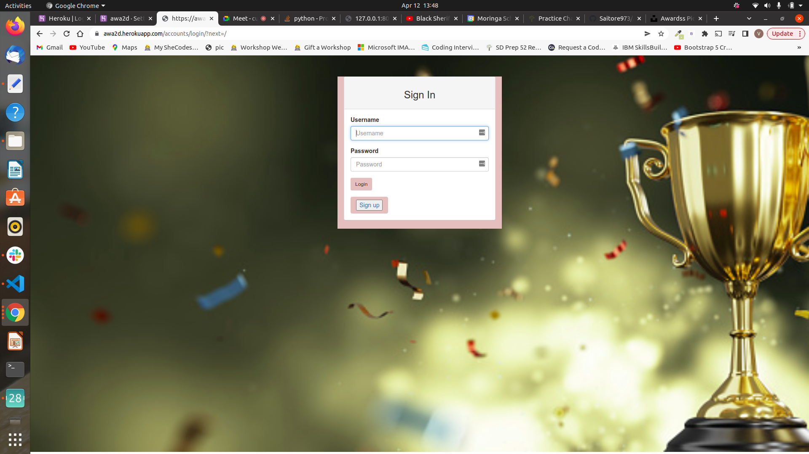
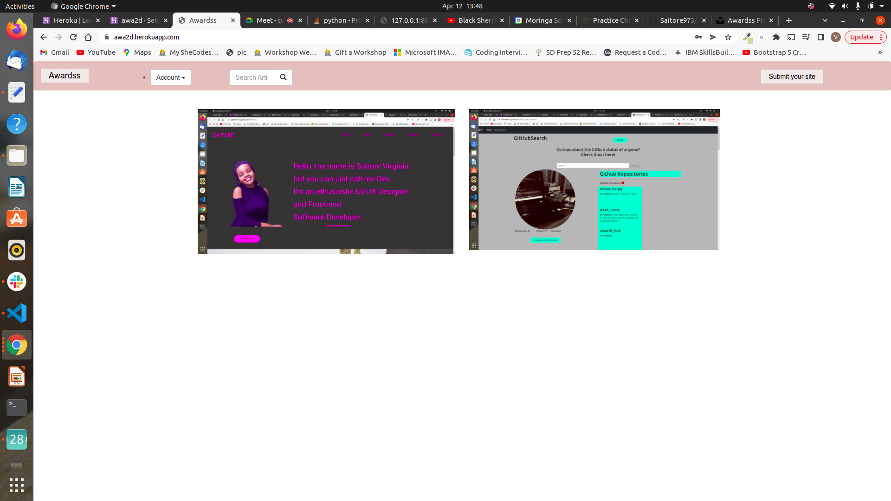
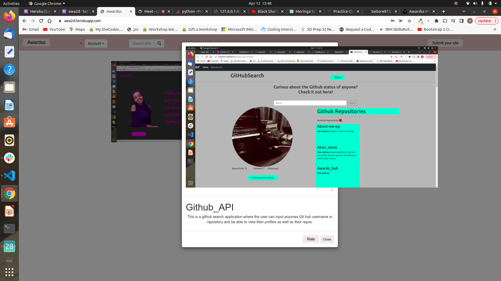

# project-awwards

>[Saitore-Virginia](https://github.com/Saitore973)  
  
# Description  
This project allows users to post their projects for other users to rate according to design, usability and content 
##  Live Link  
 Click [View Site](https://awa2d.herokuapp.com/)  to visit the site
  
## Screenshots 
###### Login
 

 
 ###### Home page


###### Details


 
## User Story  
  
* A user can view posted projects and their details.  
* A user can post a project to be rated/reviewed. 
* A user can rate/ review other users' projects.  
* Search for projects.  
* View projects overall score.
* A user can view their profile page.  
  

  
## Setup and Installation  
To get the project .......  
  
##### Cloning the repository:  
 ```bash 
 https://github.com/Saitore973/Awards_hub
```
##### Navigate into the folder and install requirements  
 ```bash 
cd project-awwards pip install -r requirements.txt 
```
##### Install and activate Virtual  
 ```bash 
- python3 -m venv virtual - source virtual/bin/activate  
```  
##### Install Dependencies  
 ```bash 
 pip install -r requirements.txt 
```  
 ##### Setup Database  
  SetUp your database User,Password, Host then make migrate  
 ```bash 
python manage.py makemigrations instagram
 ``` 
 Now Migrate  
 ```bash 
 python manage.py migrate 
```
##### Run the application  
 ```bash 
 python manage.py runserver 
``` 
##### Testing the application  
 ```bash 
 python manage.py test 
```
Open the application on your browser `127.0.0.1:8000`.  
  
 ### Api Endpoints
 * https://chawwards.herokuapp.com/api/users/
 * https://chawwards.herokuapp.com/api/profile/
 * https://chawwards.herokuapp.com/api/posts/
 
 
## Technology used  
  
* [Python3.6](https://www.python.org/)  
* [Django 1.11](https://docs.djangoproject.com/en/2.2/)  
* [Heroku](https://heroku.com)  
  
  
## Known Bugs  
* There are no known bugs currently but pull requests are allowed incase you spot a bug  
  
## Contact Information   
If you have any question or contributions, please email me at [saitorevg@gmail.com]  
  
## License 


* Copyright (c) 2022 **Saitore Virginia**